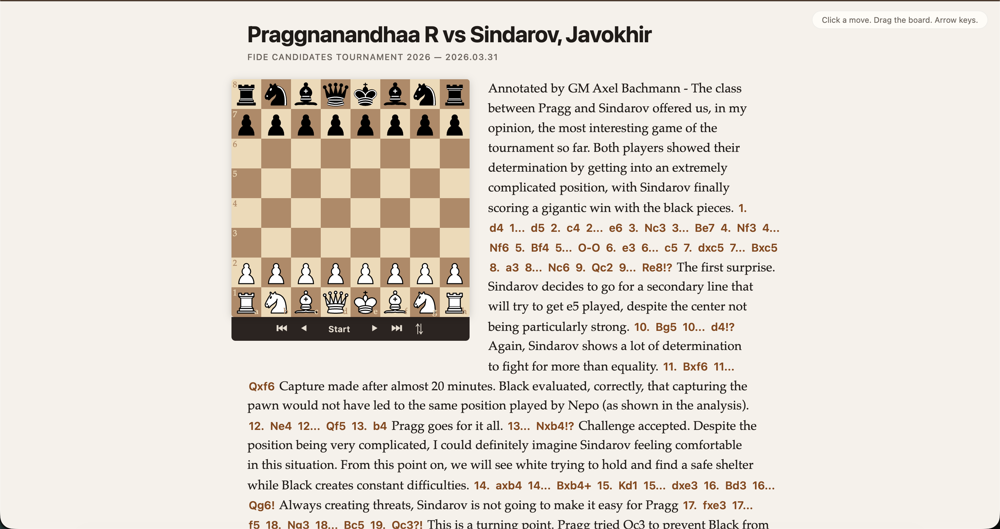

# chess-pretext

experimenting with a chess blog reader where text reflows around a draggable board in real time powered by [pretext](https://github.com/chenglou/pretext) for dom-free text measurement and layout.

## how it works

pretext's `prepareWithSegments()` runs once on the article text. on every frame (during drag or resize), `layoutNextLine()` computes line breaks with variable widths carved around the board obstacle; arithmetic on cached segment widths, no canvas or dom reads. each line is an absolutely positioned dom element.

